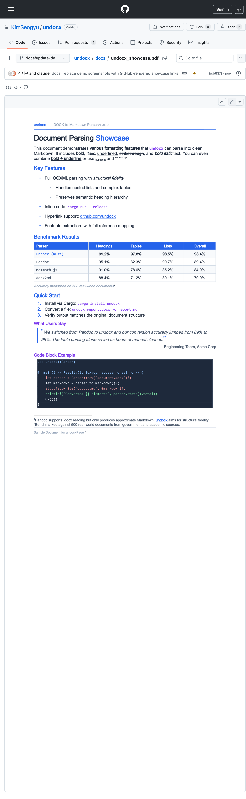
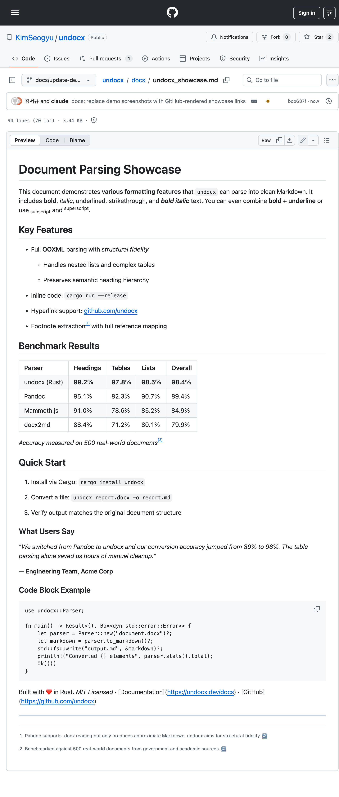

# undocx

[](https://crates.io/crates/undocx)
[](https://pypi.org/project/undocx/)
[](https://docs.rs/undocx)
[](https://opensource.org/licenses/MIT)

Fast, accurate DOCX to Markdown converter written in Rust with Python bindings.

## Conversion Demo

<table>
<tr>
<td align="center"><strong>DOCX (input)</strong></td>
<td align="center"><strong>Markdown (output)</strong></td>
</tr>
<tr>
<td><a href="docs/undocx_showcase.pdf"></a></td>
<td><a href="docs/undocx_showcase.md"></a></td>
</tr>
</table>

> Click images to see full GitHub-rendered files. Headings, bold/italic/underline, tables, nested lists, footnotes, code blocks, track changes -- all converted automatically.

## Install

```bash
pip install undocx          # Python
cargo install undocx        # CLI
```

```toml
# Rust library
[dependencies]
undocx = "0.3"
```

## Quick Start

**CLI**
```bash
undocx report.docx output.md              # convert to file
undocx report.docx                         # print to stdout
undocx report.docx -o out.md --images-dir ./img  # extract images
```

**Python**
```python
import undocx

markdown = undocx.convert_docx("report.docx")           # from path
markdown = undocx.convert_docx(open("r.docx","rb").read())  # from bytes
```

**Rust**
```rust
use undocx::{ConvertOptions, DocxToMarkdown, ImageHandling};

let options = ConvertOptions {
    image_handling: ImageHandling::SaveToDir("./images".into()),
    ..Default::default()
};
let converter = DocxToMarkdown::new(options);
let markdown = converter.convert("report.docx")?;
```

## Supported Features

| Category | Elements |
|----------|----------|
| **Text** | Bold, italic, underline, strikethrough, superscript/subscript |
| **Structure** | Heading 1-9, Title, Subtitle, alignment (center/right) |
| **Lists** | Ordered (decimal, letter, roman, Korean, circled), unordered, nested |
| **Tables** | Colspan, rowspan, nested tables, multi-paragraph cells |
| **Links** | External, internal bookmarks, TOC anchors |
| **Images** | Inline, floating, VML legacy -- base64 embed, save to dir, or skip |
| **Notes** | Footnotes, endnotes, comments (as Markdown `[^ref]`) |
| **Track changes** | Insertions (`<ins>`), deletions (`~~strikethrough~~`) |
| **Other** | Page/column/line breaks, SDT, field codes, bookmarks, symbols |

## Options

| Field | Default | Description |
|-------|---------|-------------|
| `image_handling` | `Inline` | `Inline` / `SaveToDir(path)` / `Skip` |
| `preserve_whitespace` | `false` | Keep original spacing |
| `html_underline` | `true` | `<u>` tags for underline |
| `html_strikethrough` | `false` | `<s>` tags instead of `~~` |
| `strict_reference_validation` | `false` | Fail on broken note/comment refs |

## Advanced: Custom Pipeline

Replace the default extractor or renderer:

```rust
let converter = DocxToMarkdown::with_components(
    ConvertOptions::default(),
    MyExtractor,    // impl AstExtractor
    MyRenderer,     // impl Renderer
);
```

See [docs/API_POLICY.md](docs/API_POLICY.md) for stability guarantees on these traits.

## Development

```bash
cargo test --all-features                                  # test
cargo clippy --all-features --tests -- -D warnings         # lint
./scripts/run_perf_benchmark.sh                            # bench
```

## License

MIT
